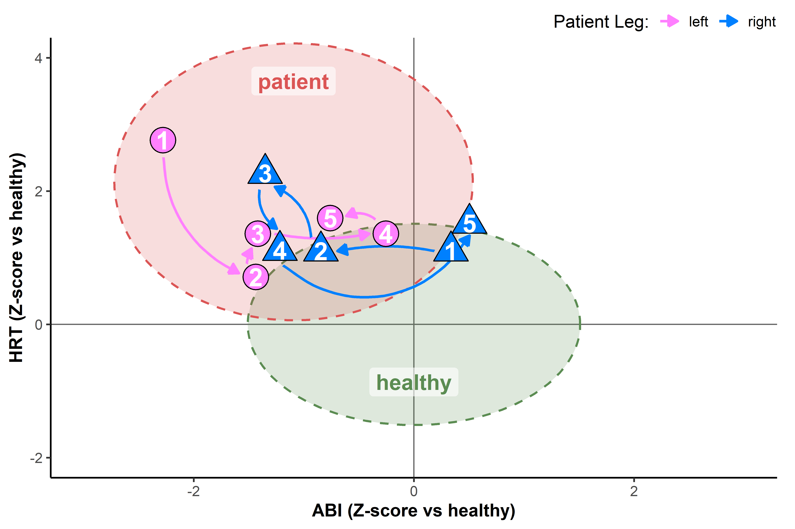

# Figure 2 — ABI and NIRS HRT case patient data against normative distributions
Jem I Arnold <a href="https://github.com/jemarnold/mnirs"
target="&quot;_blank&quot;"></a>
<a href="https://www.linkedin.com/in/jem--arnold/"
target="&quot;_blank&quot;"></a>
<a href="https://researchgate.net/profile/Jem-Arnold"
target="&quot;_blank&quot;"></a>
<a href="https://orcid.org/0000-0003-3908-9447"
target="&quot;_blank&quot;"></a>
2026-09-28

This report reproduces **Figure 2** from the manuscript: *Arnold JI,
Pignanelli C, Hodgins A, O’Croinin E, Koehle MS. Return to Sport After
Two Sequential Iliac Artery Reconstructions in an Elite Cyclist: A Case
Report* (currently pre-submission).

Please contact the authors for further information (author email above).

## Setup

Requires libraries from `tidyverse` and `mnirs` (for plotting only).

``` r
library(tibble)
library(tidyr)
library(dplyr)
library(ggplot2)
library(mnirs)

theme_set(theme_mnirs(base_size = 14))

## case report patient data
case_data <- tribble(
    ~trial , ~leg    , ~abi , ~hrt ,
         1 , "left"  , 0.47 ,    54 ,
         2 , "left"  , 0.57 ,    24 ,
         3 , "left"  , 0.59 ,    31 ,
         4 , "left"  , 0.71 ,    31 ,
         5 , "left"  , 0.65 ,    34 ,
         1 , "right" , 0.78 ,    28 ,
         2 , "right" , 0.64 ,    28 ,
         3 , "right" , 0.58 ,    43 ,
         4 , "right" , 0.59 ,    29 ,
         5 , "right" , 0.80 ,    33 ,
) |>
    mutate(
        trial = factor(trial),
        leg = factor(leg, levels = c("left", "right")),
    )
```

## Normative reference statistics

Reference distributions extracted from individual participant data from:
van Hooff M, Arnold J, Meijer E, et al. (2022) Diagnosing sport-related
flow limitations in the iliac arteries using near-infrared spectroscopy.
*J Clin Med*. <https://dx.doi.org/10.3390/jcm11247462>. Raw participant
data cannot be shared. The figure below can be reproduced with summary
statistics, which are embedded here.

Group sizes:

| param | healthy | patient |
|-------|--------:|--------:|
| ABI   |      66 |     306 |
| HRT   |      58 |     223 |

Derivation from the raw database `db` (not included; not run):

``` r
## transform: HRT is right-skewed (log approximately normalises it);
## ABI is near-symmetric, so it stays on the raw scale
transform_param <- function(value, param) {
    if_else(param == "hrt", log(value), value)
}

## robust z-score reference from healthy: median and IQR-derived SD
## (IQR / 1.349), resistant to outliers and non-normal tails
ref <- db |>
    filter(group == "healthy") |>
    summarise(
        .by = param,
        ref_centre = median(transform_param(value, param)),
        ref_scale = IQR(transform_param(value, param)) / (2 * qnorm(0.75)),
    )

db_z <- db |>
    left_join(ref, by = "param") |>
    mutate(z = (transform_param(value, param) - ref_centre) / ref_scale)

## robust centre and spread of each group per axis, on the healthy z-scale
group_stats <- db_z |>
    summarise(
        .by = c(group, param),
        mid = median(z),
        s = IQR(z) / (2 * qnorm(0.75)),
    ) |>
    pivot_wider(names_from = param, values_from = c(mid, s))
```

Embedded output of the above:

``` r
## healthy reference: median and IQR / 1.349 on the transformed scale
ref <- tribble(
    ~param , ~ref_centre , ~ref_scale ,
    "abi"  , 0.740197    , 0.118514   ,
    "hrt" , 2.896581    , 0.395201   ,
)

## group centre and spread in healthy z-units. healthy is 0 / 1 by construction
group_stats <- tribble(
    ~group    , ~mid_abi  , ~mid_hrt , ~s_abi   , ~s_hrt  ,
    "healthy" ,  0        , 0         , 1        , 1        ,
    "patient" , -1.093616 , 2.139775  , 1.078512 , 1.376109 ,
)

ref
```

    # A tibble: 2 × 3
      param ref_centre ref_scale
      <chr>      <dbl>     <dbl>
    1 abi        0.740     0.119
    2 hrt        2.90      0.395

``` r
group_stats
```

    # A tibble: 2 × 5
      group   mid_abi mid_hrt s_abi s_hrt
      <chr>     <dbl>   <dbl> <dbl> <dbl>
    1 healthy    0       0     1     1   
    2 patient   -1.09    2.14  1.08  1.38

## Group ellipses and case z-scores

``` r
## transform: HRT is right-skewed (log approximately normalises it);
## ABI is near-symmetric, so it stays on the raw scale
transform_param <- function(value, param) {
    if_else(param == "hrt", log(value), value)
}

## 68% bivariate normal ellipse per group. ABI and HRT vectors are unpaired,
## so their correlation cannot be estimated: axes assumed independent (r = 0),
## giving axis-aligned ellipses
ellipses <- group_stats |>
    cross_join(tibble(t = seq(0, 2 * pi, length.out = 200))) |>
    mutate(
        r = sqrt(qchisq(0.68, df = 2)),
        abi = mid_abi + r * s_abi * cos(t),
        hrt = mid_hrt + r * s_hrt * sin(t),
    )

## case study on same z-scale
case_z <- case_data |>
    pivot_longer(c(abi, hrt), names_to = "param") |>
    left_join(ref, by = "param") |>
    mutate(z = (transform_param(value, param) - ref_centre) / ref_scale) |>
    pivot_wider(id_cols = c(trial, leg), names_from = param, values_from = z) |>
    ## display-only nudge (z-units) to separate overlapping markers and open
    ## space for arrows
    mutate(
        key = paste(leg, trial),
        abi = abi +
            recode_values(
                key,
                "left 3" ~ -0.15,
                "right 4" ~ 0.05,
                default = 0
            ),
        hrt = hrt +
            recode_values(
                key,
                "right 3" ~ 0.08,
                "right 4" ~ -0.08,
                default = 0
            ),
    )

## arrows trimmed at both ends to clear markers. y scaled by panel aspect
## (asp = height / width per z-unit) so gap is uniform on screen
case_arrows <- case_z |>
    arrange(leg, trial) |>
    mutate(
        .by = leg,
        abi_end = lead(abi),
        hrt_end = lead(hrt),
        gap = 0.15,
        asp = 0.6,
        ## per-arrow curvature to route arcs around other markers
        curv = recode_values(
            key,
            "left 2" ~ -0.1,
            "left 3" ~ 0.1,
            "right 1" ~ 0.1,
            "right 4" ~ 0.5,
            default = 0.3
        ),
        len = sqrt((abi_end - abi)^2 + (asp * (hrt_end - hrt))^2),
        dx = gap * (abi_end - abi) / len,
        dy = gap * (hrt_end - hrt) / len,
        abi = abi + dx,
        hrt = hrt + dy,
        abi_end = abi_end - dx,
        hrt_end = hrt_end - dy,
        ## manual arrow offsets (z-units) after auto-trim, keyed by arrow
        ## start point (e.g. "right 4" = arrow 4 -> 5)
        abi = abi +
            recode_values(
                key,
                "left 1" ~ -0.08,
                "left 2" ~ -0.09,
                "left 4" ~ 0.05,
                "right 3" ~ -0.08,
                "right 4" ~ -0.12,
                default = 0
            ),
        hrt = hrt +
            recode_values(
                key,
                "left 1" ~ -0.05,
                "left 2" ~ -0.05,
                "left 4" ~ 0.15,
                "right 4" ~ -0.26,
                default = 0
            ),
        abi_end = abi_end +
            recode_values(
                key,
                "left 1" ~ -0.07,
                "left 2" ~ -0.05,
                "right 4" ~ 0.15,
                default = 0
            ),
        hrt_end = hrt_end +
            recode_values(
                key,
                "left 1" ~ -0.15,
                "left 2" ~ 0.03,
                "left 4" ~ 0.1,
                "right 3" ~ 0.08,
                "right 4" ~ -0.15,
                default = 0
            ),
    ) |>
    drop_na()
```

## Figure

``` r
# fmt: skip
ggplot() +
    aes(x = abi, y = hrt) +
    labs(x = "ABI (Z-score vs healthy)", y = "HRT (Z-score vs healthy)") +
    coord_cartesian(xlim = c(-3, 3), ylim = c(-2, 4)) +
    scale_colour_manual(
        name = "Patient Leg:",
        aesthetics = c("colour", "fill"),
        values = setNames(
            mnirs::palette_mnirs(
                "light red", "light green", "pink", "light blue"
            ), c("patient", "healthy", "left", "right")
        ),
        breaks = c("left", "right")
    ) +
    scale_shape_manual(values = c(left = 21, right = 24)) +
    guides(fill = "none", shape = "none") +
    geom_vline(xintercept = 0, linewidth = 0.5, colour = "grey40") +
    geom_hline(yintercept = 0, linewidth = 0.5, colour = "grey40") +
    geom_polygon(
        data = ellipses,
        aes(colour = group, fill = group),
        linetype = "dashed", linewidth = 0.8, alpha = 0.2, show.legend = FALSE,
    ) +
    geom_label(
        data = transmute(group_stats, group, abi = mid_abi, hrt = mid_hrt),
        aes(label = group, colour = group),
        size = 6, vjust = c(2.5, -3), fill = alpha("white", 0.6),
        linewidth = NA, fontface = "bold", show.legend = FALSE,
    ) +
    lapply(split(case_arrows, ~curv), \(d) geom_curve(
        data = d,
        aes(xend = abi_end, yend = hrt_end, colour = leg),
        curvature = d$curv[1], linewidth = 1,
        arrow = arrow(length = unit(0.3, "cm"), type = "closed"),
    )) +
    geom_point(
        data = case_z,
        aes(fill = leg, shape = leg),
        size = 9, show.legend = FALSE
    ) +
    geom_text(
        data = case_z,
        aes(label = trial),
        colour = "white", size = 7, fontface = "bold"
    )
```

<div id="fig-case-include">



Figure 1: Patient ankle-brachial pressure index (ABI) and muscle
reoxygenation half-recovery times (HRT), converted to Z-scores based on
a published cohort of 66 healthy cyclists (green area) and 306 FLIA
patients (red area). Shaded clusters represent the distribution of each
group. Points numbered 1 to 5 were recorded bilaterally in the patient’s
left (pink) and right (blue) legs at each monitoring assessment across
the sequential RTS periods. Numbers correspond to the timeline in Figure
1 and values in Table 1. Values closer to the centre of the green
“healthy” distribution indicate improvement. The left leg in pink
improved from pre-surgery (1) to post-surgery (2), with ABI and HRT
maintained until the final assessment (5). The right leg in blue
worsened from assessment 1 with symptom onset around assessment 3, then
improved again after right-leg surgery in assessments 4 and 5.

</div>

## Session info

``` r
sessionInfo()
```

    R version 4.6.1 (2026-06-24 ucrt)
    Platform: x86_64-w64-mingw32/x64
    Running under: Windows 11 x64 (build 26100)

    Matrix products: default
      LAPACK version 3.12.1

    locale:
    [1] LC_COLLATE=English_Canada.utf8  LC_CTYPE=English_Canada.utf8   
    [3] LC_MONETARY=English_Canada.utf8 LC_NUMERIC=C                   
    [5] LC_TIME=English_Canada.utf8    

    time zone: America/Vancouver
    tzcode source: internal

    attached base packages:
    [1] stats     graphics  grDevices utils     datasets  methods   base     

    other attached packages:
    [1] mnirs_0.8.0   ggplot2_4.0.3 dplyr_1.2.1   tidyr_1.3.2   tibble_3.3.1 

    loaded via a namespace (and not attached):
     [1] vctrs_0.7.3        cli_3.6.6          knitr_1.51         rlang_1.3.0       
     [5] xfun_0.60          otel_0.2.0         purrr_1.2.2        generics_0.1.4    
     [9] S7_0.2.2           jsonlite_2.0.0     glue_1.8.1         htmltools_0.5.9   
    [13] scales_1.4.0       rmarkdown_2.32     grid_4.6.1         evaluate_1.0.5    
    [17] fastmap_1.2.0      yaml_2.3.12        lifecycle_1.0.5    compiler_4.6.1    
    [21] RColorBrewer_1.1-3 pkgconfig_2.0.3    farver_2.1.2       digest_0.6.39     
    [25] R6_2.6.1           utf8_1.2.6         tidyselect_1.2.1   pillar_1.11.1     
    [29] magrittr_2.0.5     withr_3.0.3        gtable_0.3.6       tools_4.6.1       
